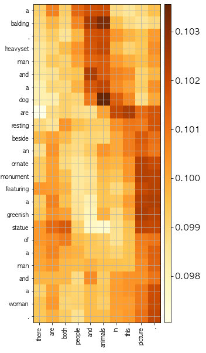

# A Decomposable Attention Model for Natural Language Inference  
  
#### cuteboydot@gmail.com    
  
#### reference  
1. [A Decomposable Attention Model for Natural Language Inference, P Parikh](https://arxiv.org/pdf/1606.01933.pdf)  
  
#### data reference  
1. [snli - Stanford NLP](https://nlp.stanford.edu/projects/snli/)  
  
### 1. A Decomposable Attention Model    
  
  
본 모델의 경우 두 문장 사이의 관계를 분류한다.  
기존에는 단어 단위의 학습을 위해 attention을 많이 사용한다.  
본 모델의 장점은 두 문장의 단어간의 attention을 사용하여 성능을 향상한다.     
  
  
  
  
  
두 문장간의 attention은 우선 두 문장의 히든 벡터들을 곱하여 학습한다. 
이는 [batch, words1, state] * [batch, state, words2] => [batch, words1, words2]의 형태로 만들어주며,  
이를 통해 문장 1의 단어별 문장2의 attention 가중치를 구할수 있다. (반대의 경우 문장2의 단어별 문장1의 단어별 attention 또한 구할 수 있다.)  
    
  
  
  
  
이후 attention 정보와 히든 벡터의 정보를 뉴럴네트워크 G함수로 넣어 v1, v2를 얻는다.  
그리고 마지막으로 v1, v2를 합해 최종 컨택스트 벡터를 얻는다.  

  
  
### 2. Test result   
#### 2.1 Variants model  
##### Vanilla : 논문에서 가장기본적으로 기술한 내용의 모델이다. 워드 임베딩 -> 뉴럴네트워크 -> attention의 흐름이다.  
5epochs 수행후 Test accuracy는 74.6%를 기록하였다.  
(snli_dec_vanilla_model.py, snli_dec_vanilla_trainer.py)  
##### Bi-RNN : 위 버전에서 조금 나은 성능향상을 위해 개인적으로 시도해보았다. 워드 임베딩 -> Bi-RNN(GRU) -> attention의 흐름이다.  
5epochs 수행후 Test accuracy는 76.3%를 기록하였다.  
(snli_dec_rnn_model.py, snli_dec_rnn_trainer.py)  

#### 2.2 Examples  
  
  

